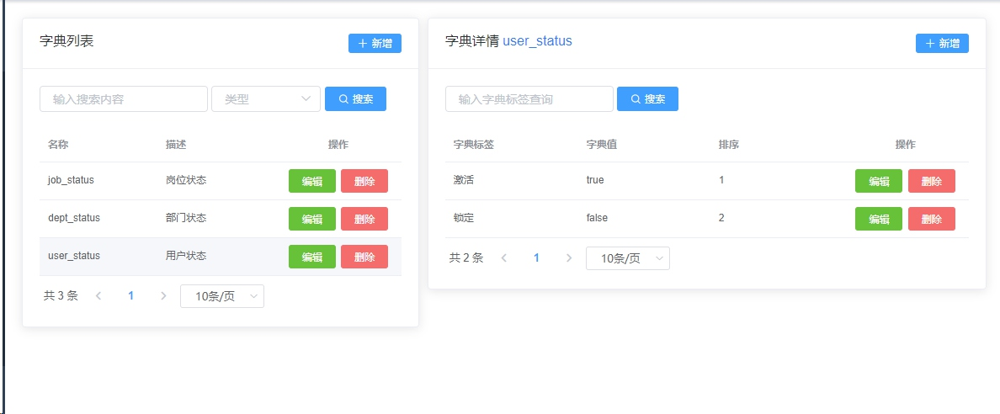

#### 配置字典
设计思路，前端可通过字典名称（唯一）查询字典详情来实现动态字典的功能


查询会不能很麻烦，这个不用担心，我已经大家封装好了
``` javascript
import { get } from '@/api/dictDetail'

export default {
  data() {
    return {
      dicts: []
    }
  },
  methods: {
    async getDict(name) {
      return new Promise((resolve, reject) => {
        get(name).then(res => {
          this.dicts = res.content
          resolve(res)
        }).catch(err => {
          reject(err)
        })
      })
    }
  }
}
```
怎么使用呢（建议看源代码），举个栗子

**（1）引入组件**
``` javascript
import initDict from '@/mixins/initDict'
export default {
  mixins: [initDict]
}
```
**（2）使用钩子函数获取字典**
``` javascript
import initDict from '@/mixins/initDict'
export default {
 mixins: [initDict],
 created() {
    this.$nextTick(() => {
      // 加载数据字典
      this.getDict('job_status')
    })
  }
}
```
**（3）使用字典**
```javascript
<el-form-item v-if="form.pid !== 0" label="状态" prop="enabled">
        <el-radio v-for="item in dicts" :key="item.id" v-model="form.enabled" :label="item.value">{{ item.label }}</el-radio>
 </el-form-item>
```